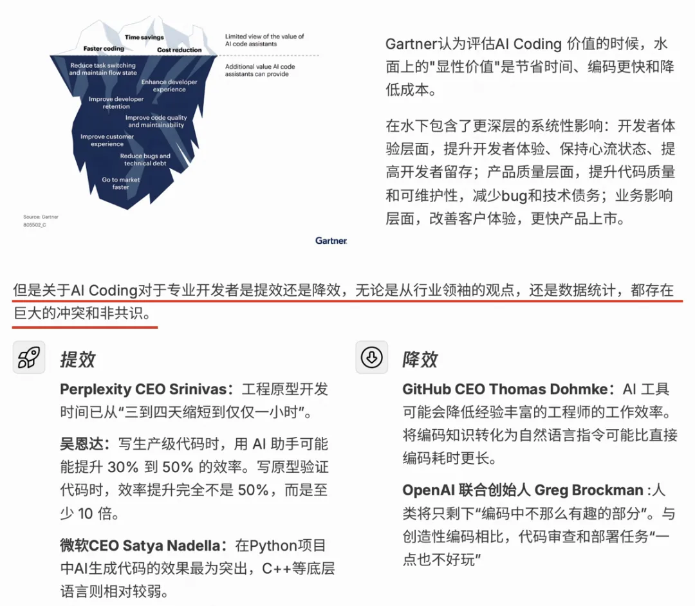

# ## 研发范式转换
AI 对研发团队的价值,不仅仅在单点编码速度的提升，而在压缩从需求到交付之间的理解成本、对齐成本和重复成本。

我们正处在一个 研发范式转换 的窗口期；

阶段	人做什么	系统做什么	解决什么问题
SE 1.0	全做——理解、设计、写代码、测试	被动执行	把需求做出来
SE 2.0	设计流程和规则	CI/CD、自动化测试帮忙干重复的活	把重复劳动规范化
SE 3.0	定义目标、守住边界、做关键决策	AI 帮忙理解业务、出方案、搭框架、沉淀知识	把理解成本和方案成本降下来

研发实际痛点：
需求不清 / 变更频繁 -> 反复解释与对齐 -> 设计返工 / 开发重做 -> 测试排期 / 上线流程继续放大等待时间

人机协同理想流程:
需求/问题输入:
        AI 业务理解
        AI 方案草拟
        AI 框架生成
        AI 知识沉淀
人工 Review -> 落地交付

## AI 提效
很多人聊 AI 提效，第一反应是"代码补全", 真正卡交付的除了编码以外（耗时占比 30% - 40%）， 需求和技术调研阶段 （耗时占比30%左右） 同样需要重点关注 ；

问题	现象	AI 能不能解	我的优先级判断
理解成本高	接手陌生业务慢，信息散落在人/文档/代码/群聊	能——AI 读代码+文档，出全景图	P0，最该先投
方案反复拉扯	设计返工多，需求澄清来回好几轮	能——Spec + Demo 让方案可见	P0，跟理解成本一起解
重复实现	约 30% 开发工作属相似功能	能——Skill + Spec 模板	P1，标准化解决
流程冗余	小需求仍走双周迭代完整流程	部分能——AI 降不了流程成本	P2，靠流程治理

AI 应该优先投在"理解加速"和"方案预验证"这两个环节。因为超长项目 50% 以上的瓶颈就在需求阶段，而且这两个环节的效果已经被我们的项目验证了。

## 关于人机协作的思考
需要 重新设计 "人机分工"里团队分工 以及协同方式，从而最大化的提升 交付效率；

### 知识&能力沉淀
如何将个人技巧变成团队资产
资产	解决什么	什么时候建
agents.md	降低业务理解重复成本，让 AI 和新人都能快速进入状态	项目启动时优先创建
Skill 文件	降低高频重复操作成本	同类操作出现 3 次以上就封装
Spec 模板	降低方案设计从零开始成本	每个需求类型至少 1 个模板
Trace / Eval	让 Agent 项目可观测、可迭代	Agent 项目第一天就要建

### 交付内容的变化
阶段	以前交付内容	现在交付内容	变化
业务理解	文字笔记，留在脑子里	全景图 + 数据链路图 + agents.md	可传递、可沉淀
技术设计	文字说明 + 流程图	文档 + 可交互 Demo + 50% 代码	提前验证，减少返工
开发	从零写	50% 框架代码已有	聚焦核心逻辑
Agent 项目	线下excel	Trace + Eval + 数据集	可观测、可迭代

# AI 研发提效陷阱

## 用 AI 开发工具 ≠ 个人提效 ≠ 组织提效

2
