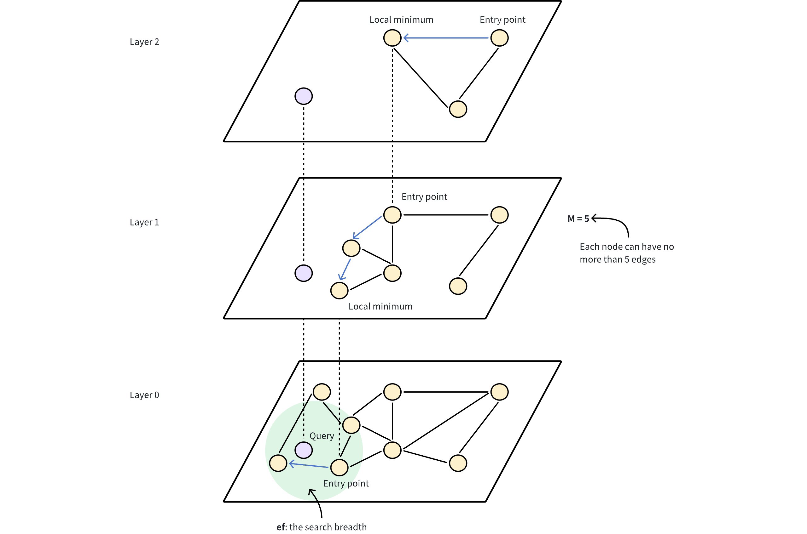

## Embedding 
### 本质：把文本/图片/音频 转成高维浮点数数组。
例如
```
"我喜欢猫"
->

[0.123, -0.882, 0.551, ...]
```
这个数组就叫：
- 向量
- embedding
- 特征表示


### 为什么它能表达语义？因为模型训练后，“语义相近”的内容，在向量空间里距离更近。
比如：
```
"猫"
"小猫"
"橘猫"
```
距离会近。


而：
```
"猫"
"数据库"
```
距离会远。

### 为什么关系数据库不适合?
向量搜索是高维空间搜索, 例如：768维，1024维，1536维。这种情况下，传统 B+Tree 基本失效，会出现维度灾难

### 第一阶段 只学“向量搜索”：
1. “文本相似搜索” (Faiss,它几乎是所有向量数据库底层思想的原点。)
2. 接下来学“引索” （ANN 索引）
    重点理解 HNSW(Hierarchical Navigable Small World)
    本质：给向量建立“近邻图”。类似： A -> B -> C，查询时不是全量扫描。而是从某个节点开始，不断跳向“更近”的节点。(牺牲一点精度,换极大速度)

### 第二阶段 实践
1. 先学 Qdrant（轻量，本地docker就能跑）
2. 然后做一个最小 RAG 项目

项目结构： 
```
PDF
-> 切块 chunk
-> embedding
-> 存入向量数据库
-> 用户提问
-> 检索相关 chunk
-> 喂给LLM
-> 生成答案
```

你会真正理解：
- 为什么要 chunk
- 为什么 embedding
- 为什么 top-k
- 为什么 rerank
- 为什么 hybrid search

## 最终学习路线
第1周： 理解 embedding + 相似搜索
第2周： 理解 ANN
第3周： 学习真正数据库，Qdrant
第4周： 做最小RAG


欧式距离：基于勾股定理，定义为各维度坐标差的平方和的平方根。

## 文本相似搜索 Faiss
Faiss 处理的是固定维度 d 的向量集合。
需要准备两个矩阵：
- xb: 作为数据库向量，存储需要建立索引、并用于检索的所有向量，尺寸为 nb x d
- xq: 作为查询向量，用于查找最近邻，尺寸为 nq x d。 如果只有一个查询，nq = 1

注意： 在 Python 中，所有矩阵均使用 numpy 数组表示，数据类型 (dtype) 必须为 float32。

## 构建索引并添加向量
### **暴力 L2 距离** 近邻搜索索引
所有索引在创建时都需要知道向量的维度 d。 大部分索引还需要一个“训练”阶段来分析数据分布，但 IndexFlatL2 无需训练，可直接使用。

### 建立好索引（并完成必要的训练）后，主要有两类操作：
1. add：向索引中添加数据库向量（如 xb）
2. search：向索引查询最近邻

### 另外可以查看索引的两个状态变量：
- is_trained：布尔值，指示是否需要训练
- ntotal：已索引的向量个数

### 存储自定义整数
部分索引还可以存储自定义整数 ID（但 IndexFlatL2 不支持）。若未提供，默认会按照插入顺序分配 ID：第一个向量为 0，第二个为 1，依此类推。


## HNSW 索引 （分层导航小世界）
是一种**基于图**的索引算法，可以提高搜索 高维浮动向量 时的性能。

HNSW算法构建了一个多层图，有点像不同缩放级别的地图。底层包含所有数据点，而上层则由从底层采样的数据点子集组成。

上层提供远距离跳转，以快速接近目标，而下层则进行细粒度搜索，以获得最准确的结果。

工作原理：
1. 入口点：搜索从顶层的一个固定入口点开始，该入口点是图中的一个预定节点。
2. 贪婪搜索：算法贪婪地移动到当前层的最近邻居，直到无法再接近查询向量为止。上层起到导航作用，作为粗过滤器，为下层的精细搜索找到潜在的入口点。
3. 层层下降：一旦当前层达到局部最小值，算法就会通过预先建立的连接跳转到下层，并重复贪婪搜索。
4. 最后 细化：这一过程一直持续到最底层，在最底层进行最后的细化步骤，找出最近的邻居


类比：
假设你要在东京找一家便利店。
方法1：从东京边缘一路走。
```
一条街一条街找
```
会很慢。


方法2：
先
```
坐高速/地铁
快速到目标区域
```

再
```
在附近小路细找
```
这就快很多。

HNSW 分层的本质就是这个。

## Qdrant
### 核心结构
- Collection: 类似MySQL table, 例如 articles
- Point： 类似row，但每行多了 vector
例如
```
{
  "id": 1,
  "vector": [...],
  "payload": {
    "title": "FastAPI教程",
    "tag": "backend"
  }
}
```
- Payload: 类似 普通字段，用于：filter， metadata


本质
```
payload filter
+
vector ANN search
```

### 操作
将使用 Python 客户端创建一个集合，将数据加载到其中并运行一个基本的搜索查询。
比如
1. 我们存储的向量中，哪些与查询向量最相似[0.2, 0.1, 0.9, 0.7]？
2. 可以通过按有效载荷筛选来进一步缩小结果范围。让我们找到包含“伦敦”的最接近结果。这是结构化过滤， 不等于 语义搜索


但 payload filter 不等于 语义搜索


### 用真实 embedding
现在接 sentence-transformers。
效果：能根据语义匹配

