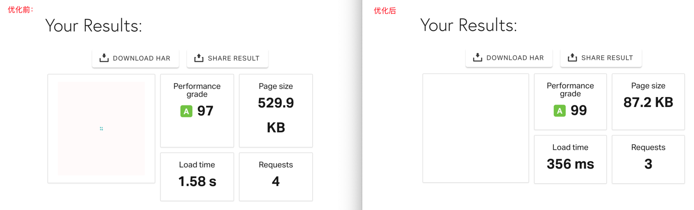
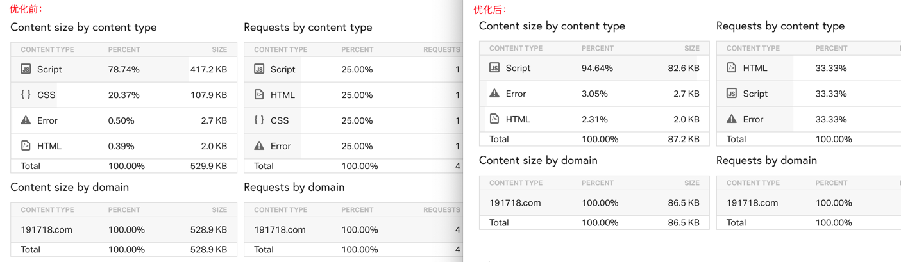
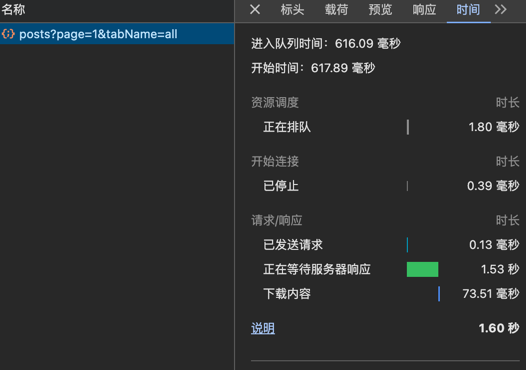
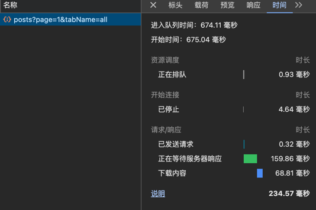
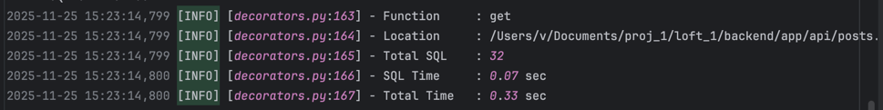
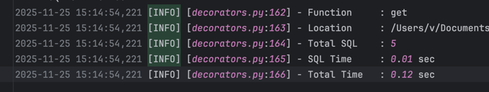

性能优化前后对比：


可以看到，首屏加载速度从1.58s减少到356ms，速度提升了77.5%。首屏需要加载的文件大小从529.9KB减少到87.2KB，减少了84%。

下面是详细的加载的具体文件大小：


可以看到，提升是显著的。


后端请求所有文章API优化

优化前：

耗时1.6s

优化后：

耗时234.57 ms

速度提升85%


# 什么是 N+1 问题，以及如何解决

假设现在有一个用户表（User）和一个余额表（Balance），这两个表通过user_id进行关联。现在有一个需求是查询年龄大于18岁的用户，以及用户各自的余额。
这个问题并不难，但对于新手而言，可能常常会犯的一个错误就是在循环中进行查询
这样做是非常糟糕的，数据量小还少，在数据量较大的情况下，是非常消耗数据库性能的。
N+1问题就是这样产生的：查询主表是一次，查询出N 条记录，根据这N 条记录，查询关联的副（从）表，共需要N 次。所以，应该叫1+N 问题更合适一些。

总结：
1.执行一次查询获取N 条主数据后，由于关联引起的执行N 次查询从数据
2.带来了不必要的查询开销


后端接口：
```
def get(self):
    """获取所有文章"""
    page = request.args.get("page", 1, type=int)
    per_page = request.args.get(
        "per_page", current_app.config["FLASKY_POSTS_PER_PAGE"], type=int
    )
    posts, total = PostGroupApi.query_post(
        page, per_page, request.args.get("tabName")
    )
    return success(data=posts, total=total)


def query_post(page, per_page, tab_name=None):
    if tab_name and tab_name == "showFollowed":
        query = current_user.followed_posts
    else:
        query = Post.query.filter_by(deleted=False)

    paginate = (
        query.order_by(Post.timestamp.desc())
        .paginate(page=page, per_page=per_page, error_out=False)
    )
    posts = paginate.items
    return [post.to_json() for post in posts], paginate.total
    
class User(db.Model): 
    posts = db.relationship("Post", backref="author", lazy="dynamic")

class Post(db.Model):
    def to_json(self):
        urls, pos = [], []
        body = self.body
        body_html = self.body_html
        if self.type == PostType.IMAGE:
            # 查询图文或者markdown类型的文章图像
            post_images = (
                Image.query.filter(
                    Image.type == ImageType.POST, Image.related_id == self.id
                )
                .order_by(Image.id.asc())
                .all()
            )
            urls = [get_avatars_url(image.url) for image in post_images]
            if self.body_html:
                # 图片对应的位置信息
                pos = [image.describe for image in post_images]
                # 正则替换html中的标签
                body = Post.replace_body(self.body, pos, urls)
                body_html = Post.replace_body_html(self.body_html, pos, urls)
    
        # 提取url和pos字段
        json_post = {
            # 'url': url_for('api.get_post', id=self.id),
            "id": self.id,
            "body": body,
            "body_html": body_html,
            # 非markdown类型，才会给post_images赋值
            "post_images": urls if not self.body_html else [],
            # markdown图片的位置
            "pos": pos,
            "post_type": self.type.value,
            "timestamp": self.timestamp
            if isinstance(self.timestamp, str)
            else DateUtils.datetime_to_str(self.timestamp),
            "author": self.author.username,
            "nick_name": self.author.nickname,
            "user_id": self.author.id,
            "comment_count": self.comments.count(),
            "image": get_avatars_url(self.author.image),
            "praise_num": self.praise.count(),
            "has_praised": Praise.has_praised(self.id),
        }
        return json_post
```

请求get接口函数时，速度很慢，生产环境测试是1.6s，用户体验上很不佳。

这里核心原因是： Post.to_json() 造成严重的 N+1 查询
在分页查询帖子后：
```
posts = paginate.items
return [post.to_json() for post in posts]
```
但 to_json() 里面有：

1) 查询 Images（N 次）：
```
post_images = Image.query.filter(
    Image.type == ImageType.POST,
    Image.related_id == self.id
).order_by(Image.id.asc()).all()
```
分页里有 10 条 post，就会执行 10 条 SQL 查询 image。

2) 查询评论数（N 次）
```
"comment_count": self.comments.count()
```
count() 每次都查数据库 → 又是 10 条。

3) 查询点赞数（N 次）
```
"praise_num": self.praise.count()
```

4) 查询是否已点赞（N 次）
```
"has_praised": Praise.has_praised(self.id)
```
如果内部又查 DB → N 次。


5) 获取 author（会触发 lazyload）
```
self.author.username
```
author 是 lazy="dynamic"，那每条 Post 又会查一次 User。


所以如果每页 10 个 posts， 一次接口 =
Images 查询：10 次
评论数查询：10 次
点赞数查询：10 次
has_praised 查询：10 次
author lazy select：10 次
= 50 次 SQL
再加主查询 1 次

总共 = 51 次数据库查询, 这是性能灾难。


实际测试，总共执行了32次：
具体统计为：
```
===== SQL STATISTICS =====
Total SQL executed: 32

[1] SELECT posts.id AS posts_id, posts.body AS posts_body, posts.body_html AS posts_body_html, posts.type AS posts_type, posts.images AS posts_images, posts.timestamp AS posts_timestamp, posts.author_id AS posts_author_id, posts.deleted AS posts_deleted 
FROM posts 
WHERE posts.deleted = false ORDER BY posts.timestamp DESC 
 LIMIT %(param_1)s, %(param_2)s

[2] SELECT count(*) AS count_1 
FROM (SELECT posts.id AS posts_id, posts.body AS posts_body, posts.body_html AS posts_body_html, posts.type AS posts_type, posts.images AS posts_images, posts.timestamp AS posts_timestamp, posts.author_id AS posts_author_id, posts.deleted AS posts_deleted 
FROM posts 
WHERE posts.deleted = false) AS anon_1

[3] SELECT images.id AS images_id, images.url AS images_url, images.`describe` AS images_describe, images.type AS images_type, images.related_id AS images_related_id, images.disabled AS images_disabled, images.`isDeleted` AS `images_isDeleted`, images.timestamp AS images_timestamp 
FROM images 
WHERE images.type = %(type_1)s AND images.related_id = %(related_id_1)s ORDER BY images.id ASC

[4] SELECT users.id AS users_id, users.email AS users_email, users.username AS users_username, users.password_hash AS users_password_hash, users.confirmed AS users_confirmed, users.nickname AS users_nickname, users.location AS users_location, users.about_me AS users_about_me, users.sex AS users_sex, users.bg_image AS users_bg_image, users.member_since AS users_member_since, users.last_seen AS users_last_seen, users.image AS users_image, users.role_id AS users_role_id, users.social_account AS users_social_account, users.music AS users_music 
FROM users 
WHERE users.id = %(pk_1)s

[5] SELECT count(*) AS count_1 
FROM (SELECT comments.id AS comments_id, comments.body AS comments_body, comments.timestamp AS comments_timestamp, comments.disabled AS comments_disabled, comments.author_id AS comments_author_id, comments.post_id AS comments_post_id, comments.root_comment_id AS comments_root_comment_id, comments.direct_parent_id AS comments_direct_parent_id 
FROM comments 
WHERE %(param_1)s = comments.post_id) AS anon_1

[6] SELECT count(*) AS count_1 
FROM (SELECT praise.id AS praise_id, praise.author_id AS praise_author_id, praise.post_id AS praise_post_id, praise.comment_id AS praise_comment_id 
FROM praise 
WHERE %(param_1)s = praise.post_id) AS anon_1

[7] SELECT images.id AS images_id, images.url AS images_url, images.`describe` AS images_describe, images.type AS images_type, images.related_id AS images_related_id, images.disabled AS images_disabled, images.`isDeleted` AS `images_isDeleted`, images.timestamp AS images_timestamp 
FROM images 
WHERE images.type = %(type_1)s AND images.related_id = %(related_id_1)s ORDER BY images.id ASC

[8] SELECT count(*) AS count_1 
FROM (SELECT comments.id AS comments_id, comments.body AS comments_body, comments.timestamp AS comments_timestamp, comments.disabled AS comments_disabled, comments.author_id AS comments_author_id, comments.post_id AS comments_post_id, comments.root_comment_id AS comments_root_comment_id, comments.direct_parent_id AS comments_direct_parent_id 
FROM comments 
WHERE %(param_1)s = comments.post_id) AS anon_1

[9] SELECT count(*) AS count_1 
FROM (SELECT praise.id AS praise_id, praise.author_id AS praise_author_id, praise.post_id AS praise_post_id, praise.comment_id AS praise_comment_id 
FROM praise 
WHERE %(param_1)s = praise.post_id) AS anon_1

[10] SELECT images.id AS images_id, images.url AS images_url, images.`describe` AS images_describe, images.type AS images_type, images.related_id AS images_related_id, images.disabled AS images_disabled, images.`isDeleted` AS `images_isDeleted`, images.timestamp AS images_timestamp 
FROM images 
WHERE images.type = %(type_1)s AND images.related_id = %(related_id_1)s ORDER BY images.id ASC

[11] SELECT count(*) AS count_1 
FROM (SELECT comments.id AS comments_id, comments.body AS comments_body, comments.timestamp AS comments_timestamp, comments.disabled AS comments_disabled, comments.author_id AS comments_author_id, comments.post_id AS comments_post_id, comments.root_comment_id AS comments_root_comment_id, comments.direct_parent_id AS comments_direct_parent_id 
FROM comments 
WHERE %(param_1)s = comments.post_id) AS anon_1

[12] SELECT count(*) AS count_1 
FROM (SELECT praise.id AS praise_id, praise.author_id AS praise_author_id, praise.post_id AS praise_post_id, praise.comment_id AS praise_comment_id 
FROM praise 
WHERE %(param_1)s = praise.post_id) AS anon_1

[13] SELECT images.id AS images_id, images.url AS images_url, images.`describe` AS images_describe, images.type AS images_type, images.related_id AS images_related_id, images.disabled AS images_disabled, images.`isDeleted` AS `images_isDeleted`, images.timestamp AS images_timestamp 
FROM images 
WHERE images.type = %(type_1)s AND images.related_id = %(related_id_1)s ORDER BY images.id ASC

[14] SELECT count(*) AS count_1 
FROM (SELECT comments.id AS comments_id, comments.body AS comments_body, comments.timestamp AS comments_timestamp, comments.disabled AS comments_disabled, comments.author_id AS comments_author_id, comments.post_id AS comments_post_id, comments.root_comment_id AS comments_root_comment_id, comments.direct_parent_id AS comments_direct_parent_id 
FROM comments 
WHERE %(param_1)s = comments.post_id) AS anon_1

[15] SELECT count(*) AS count_1 
FROM (SELECT praise.id AS praise_id, praise.author_id AS praise_author_id, praise.post_id AS praise_post_id, praise.comment_id AS praise_comment_id 
FROM praise 
WHERE %(param_1)s = praise.post_id) AS anon_1

[16] SELECT users.id AS users_id, users.email AS users_email, users.username AS users_username, users.password_hash AS users_password_hash, users.confirmed AS users_confirmed, users.nickname AS users_nickname, users.location AS users_location, users.about_me AS users_about_me, users.sex AS users_sex, users.bg_image AS users_bg_image, users.member_since AS users_member_since, users.last_seen AS users_last_seen, users.image AS users_image, users.role_id AS users_role_id, users.social_account AS users_social_account, users.music AS users_music 
FROM users 
WHERE users.id = %(pk_1)s

[17] SELECT count(*) AS count_1 
FROM (SELECT comments.id AS comments_id, comments.body AS comments_body, comments.timestamp AS comments_timestamp, comments.disabled AS comments_disabled, comments.author_id AS comments_author_id, comments.post_id AS comments_post_id, comments.root_comment_id AS comments_root_comment_id, comments.direct_parent_id AS comments_direct_parent_id 
FROM comments 
WHERE %(param_1)s = comments.post_id) AS anon_1

[18] SELECT count(*) AS count_1 
FROM (SELECT praise.id AS praise_id, praise.author_id AS praise_author_id, praise.post_id AS praise_post_id, praise.comment_id AS praise_comment_id 
FROM praise 
WHERE %(param_1)s = praise.post_id) AS anon_1

[19] SELECT users.id AS users_id, users.email AS users_email, users.username AS users_username, users.password_hash AS users_password_hash, users.confirmed AS users_confirmed, users.nickname AS users_nickname, users.location AS users_location, users.about_me AS users_about_me, users.sex AS users_sex, users.bg_image AS users_bg_image, users.member_since AS users_member_since, users.last_seen AS users_last_seen, users.image AS users_image, users.role_id AS users_role_id, users.social_account AS users_social_account, users.music AS users_music 
FROM users 
WHERE users.id = %(pk_1)s

[20] SELECT count(*) AS count_1 
FROM (SELECT comments.id AS comments_id, comments.body AS comments_body, comments.timestamp AS comments_timestamp, comments.disabled AS comments_disabled, comments.author_id AS comments_author_id, comments.post_id AS comments_post_id, comments.root_comment_id AS comments_root_comment_id, comments.direct_parent_id AS comments_direct_parent_id 
FROM comments 
WHERE %(param_1)s = comments.post_id) AS anon_1

[21] SELECT count(*) AS count_1 
FROM (SELECT praise.id AS praise_id, praise.author_id AS praise_author_id, praise.post_id AS praise_post_id, praise.comment_id AS praise_comment_id 
FROM praise 
WHERE %(param_1)s = praise.post_id) AS anon_1

[22] SELECT images.id AS images_id, images.url AS images_url, images.`describe` AS images_describe, images.type AS images_type, images.related_id AS images_related_id, images.disabled AS images_disabled, images.`isDeleted` AS `images_isDeleted`, images.timestamp AS images_timestamp 
FROM images 
WHERE images.type = %(type_1)s AND images.related_id = %(related_id_1)s ORDER BY images.id ASC

[23] SELECT users.id AS users_id, users.email AS users_email, users.username AS users_username, users.password_hash AS users_password_hash, users.confirmed AS users_confirmed, users.nickname AS users_nickname, users.location AS users_location, users.about_me AS users_about_me, users.sex AS users_sex, users.bg_image AS users_bg_image, users.member_since AS users_member_since, users.last_seen AS users_last_seen, users.image AS users_image, users.role_id AS users_role_id, users.social_account AS users_social_account, users.music AS users_music 
FROM users 
WHERE users.id = %(pk_1)s

[24] SELECT count(*) AS count_1 
FROM (SELECT comments.id AS comments_id, comments.body AS comments_body, comments.timestamp AS comments_timestamp, comments.disabled AS comments_disabled, comments.author_id AS comments_author_id, comments.post_id AS comments_post_id, comments.root_comment_id AS comments_root_comment_id, comments.direct_parent_id AS comments_direct_parent_id 
FROM comments 
WHERE %(param_1)s = comments.post_id) AS anon_1

[25] SELECT count(*) AS count_1 
FROM (SELECT praise.id AS praise_id, praise.author_id AS praise_author_id, praise.post_id AS praise_post_id, praise.comment_id AS praise_comment_id 
FROM praise 
WHERE %(param_1)s = praise.post_id) AS anon_1

[26] SELECT count(*) AS count_1 
FROM (SELECT comments.id AS comments_id, comments.body AS comments_body, comments.timestamp AS comments_timestamp, comments.disabled AS comments_disabled, comments.author_id AS comments_author_id, comments.post_id AS comments_post_id, comments.root_comment_id AS comments_root_comment_id, comments.direct_parent_id AS comments_direct_parent_id 
FROM comments 
WHERE %(param_1)s = comments.post_id) AS anon_1

[27] SELECT count(*) AS count_1 
FROM (SELECT praise.id AS praise_id, praise.author_id AS praise_author_id, praise.post_id AS praise_post_id, praise.comment_id AS praise_comment_id 
FROM praise 
WHERE %(param_1)s = praise.post_id) AS anon_1

[28] SELECT images.id AS images_id, images.url AS images_url, images.`describe` AS images_describe, images.type AS images_type, images.related_id AS images_related_id, images.disabled AS images_disabled, images.`isDeleted` AS `images_isDeleted`, images.timestamp AS images_timestamp 
FROM images 
WHERE images.type = %(type_1)s AND images.related_id = %(related_id_1)s ORDER BY images.id ASC

[29] SELECT count(*) AS count_1 
FROM (SELECT comments.id AS comments_id, comments.body AS comments_body, comments.timestamp AS comments_timestamp, comments.disabled AS comments_disabled, comments.author_id AS comments_author_id, comments.post_id AS comments_post_id, comments.root_comment_id AS comments_root_comment_id, comments.direct_parent_id AS comments_direct_parent_id 
FROM comments 
WHERE %(param_1)s = comments.post_id) AS anon_1

[30] SELECT count(*) AS count_1 
FROM (SELECT praise.id AS praise_id, praise.author_id AS praise_author_id, praise.post_id AS praise_post_id, praise.comment_id AS praise_comment_id 
FROM praise 
WHERE %(param_1)s = praise.post_id) AS anon_1

[31] SELECT count(*) AS count_1 
FROM (SELECT comments.id AS comments_id, comments.body AS comments_body, comments.timestamp AS comments_timestamp, comments.disabled AS comments_disabled, comments.author_id AS comments_author_id, comments.post_id AS comments_post_id, comments.root_comment_id AS comments_root_comment_id, comments.direct_parent_id AS comments_direct_parent_id 
FROM comments 
WHERE %(param_1)s = comments.post_id) AS anon_1

[32] SELECT count(*) AS count_1 
FROM (SELECT praise.id AS praise_id, praise.author_id AS praise_author_id, praise.post_id AS praise_post_id, praise.comment_id AS praise_comment_id 
FROM praise 
WHERE %(param_1)s = praise.post_id) AS anon_1

==========================
```

这一页有 10 条文章（posts），那么每篇文章都会执行
| 序号                     | SQL 类型    | 每篇文章执行？                                 |
| ---------------------- | --------- | --------------------------------------- |
| 3,7,10,13,22,28...     | 查询文章图片    | ✔ 每篇文章执行一次                              |
| 5,8,11,14,17,20,24,26,29,31 ... | 查询评论数量    | ✔ 每篇文章执行一次                              |
| 6,9,12,15,18,21,25,27,30,32 ... | 查询点赞数量    | ✔ 每篇文章执行一次                              |
| 4,16,19,23...          | 查询 author | ✔ 每篇文章执行一次|


为什么结果与预期的52条少了20条？
1.因为我的文章不是每篇都包含图片，有的是纯文字的文章。
    首页有10篇文章，只有6篇文章包含图片，代码中只会对图文类型的文章查询图片，所以只会触发6次查询图片。
    ```
    class Post(db.Model):
        def to_json(self):
            ...
            if self.type == PostType.IMAGE:
                    # 查询图文或者markdown类型的文章图像
                    post_images = (
                        Image.query.filter(
                            Image.type == ImageType.POST, Image.related_id == self.id
                        )
                        .order_by(Image.id.asc())
                        .all()
                    )
            ...
    ```

2.并且10篇文章由4位作者发布的。
    SQLAlchemy 会对同一个主键的对象做 identity map 缓存（也叫一级缓存 / Identity Map），不会重复查相同 id 的用户。
    这10篇文章的 author_id 只有4个不同值，所以只会触发4次查询作者。

所以这32条 SQL 其实来源于：
1 条：查询 posts 列表
1 条：统计总数
6 条：查图片
10 条：查评论 count()
10 条：查点赞 count()
4 条：查作者

如果每篇文章都包含图片，并且是不同的作者发布，那么就是1（posts） + 1（count） + 10*图片 + 10*评论 + 10*点赞 + 10*作者 = 52

# 如何优化查询呢？

优化前sql查询时间：0.07s


优化后sql查询时间：0.01s

我们将32条sql减少到了只执行5条， 执行sql总耗费时间减少了86%


## 由于post.to_json()逻辑本身就会产生N+1查询，所以任何地方调用它、只要涉及多篇文章，都会发生 N+1。
让我们继续优化to_json()函数。
我们尽量避免在to_json中查询图片，评论数量，点赞数量，作者，我们可以为post模型维护字段：comment_count ，praise_count，这样在发布评论，点赞的函数都要增加更新
post字段的逻辑。
我们也可以把 to_json 内部的数据库查询全部移除，保持 JSON 结构不变，但将查询提前批量执行，然后给每个 Post 填入数据。

我们选择后一种方法，因为它需要改动的地方最少并且效率也是最高的。
修改后如下：
```
def to_json(self, extra_data):
    if not extra_data:
        raise ValueError("to_json() 需要额外的参数")

    author_data = extra_data.get("author_data", {})
    images = extra_data.get("images", [])
    comment_count = extra_data.get("comment_count", 0)
    praise_num = extra_data.get("praise_num", 0)
    has_praised = extra_data.get("has_praised", False)

    # 从预填充数据构建图片URL和位置
    urls = [img["url"] for img in images]
    pos = [img["describe"] for img in images]

    body = self.body
    body_html = self.body_html

    if self.type == PostType.IMAGE and self.body_html:
        body = Post.replace_body(self.body, pos, urls)
        body_html = Post.replace_body_html(self.body_html, pos, urls)

    return {
        "id": self.id,
        "body": body,
        "body_html": body_html,
        "post_images": urls if not self.body_html else [],
        "pos": pos,
        "post_type": self.type.value,
        "timestamp": self.timestamp
        if isinstance(self.timestamp, str)
        else DateUtils.datetime_to_str(self.timestamp),
        "author": author_data.get("username", ""),
        "nick_name": author_data.get("nickname", ""),
        "user_id": author_data.get("id", 0),
        "comment_count": comment_count,
        "image": author_data.get("image", ""),
        "praise_num": praise_num,
        "has_praised": has_praised,
    }

def batch_query_with_data(posts):
    """
    为一组文章批量查询并预填充所有相关数据
    返回预填充了数据后的文章列表
    """

    if not posts:
        return []

    post_ids = [post.id for post in posts]

    # 1. 批量查询图片数据
    images_dict = Post._query_post_images(post_ids)

    # 2. 批量查询评论数量
    comment_counts = Post._query_comment_counts(post_ids)

    # 3. 批量查询点赞数量
    praise_counts = Post._query_praise_counts(post_ids)

    # 4. 批量查询用户点赞状态
    user_praised = Post._query_user_praised(post_ids)

    # 5. 构建extra_data映射
    extra_data_map = Post._build_extra_data(
        posts, images_dict, comment_counts, praise_counts, user_praised
    )

    # 6. 批量转换为JSON
    return [post.to_json(extra_data=extra_data_map[post.id]) for post in posts]

```


